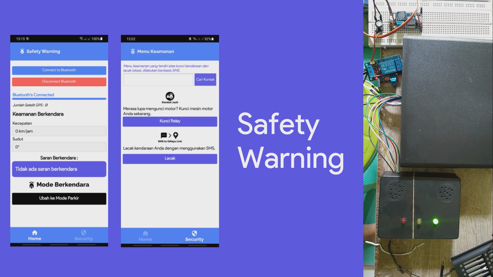
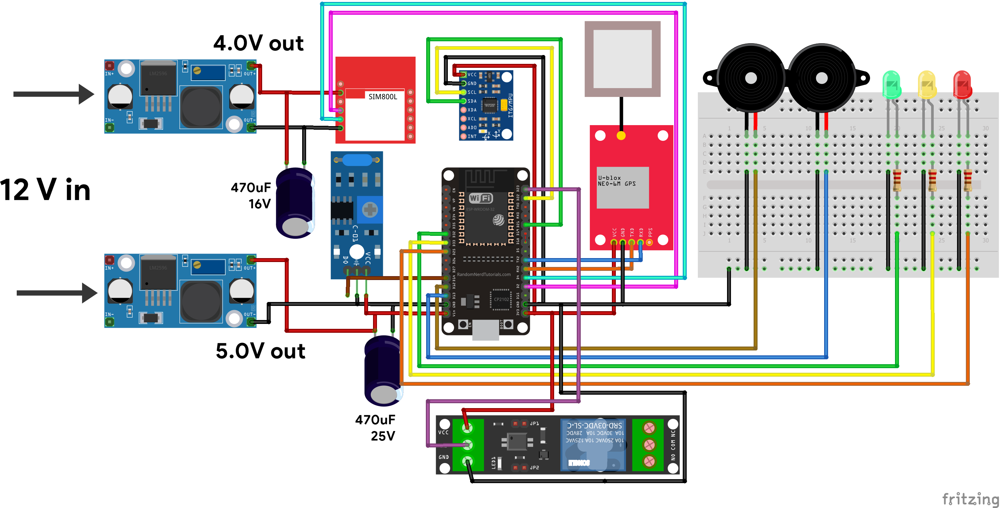
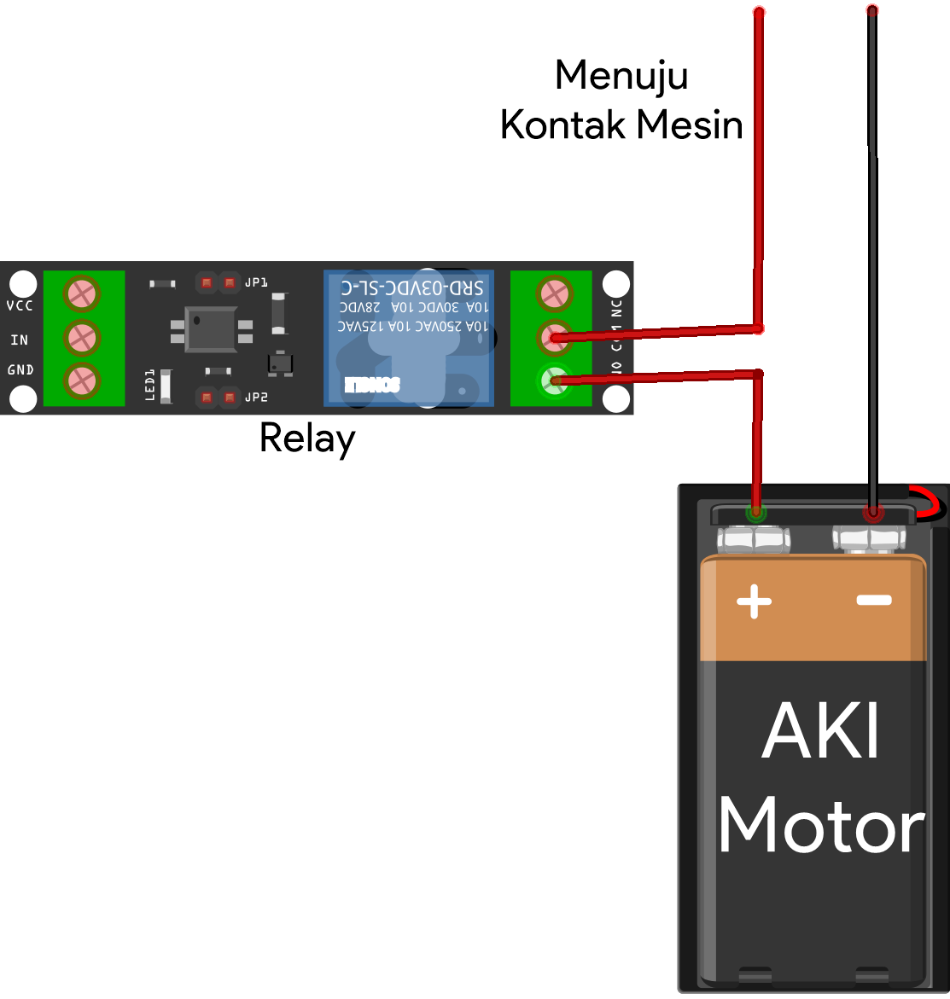
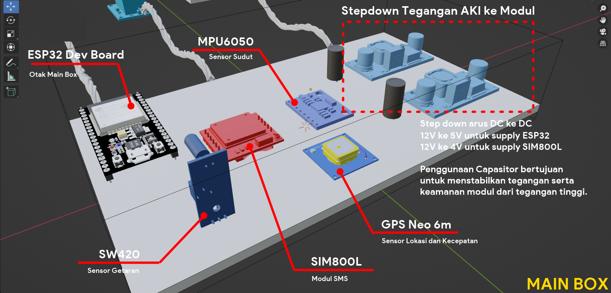
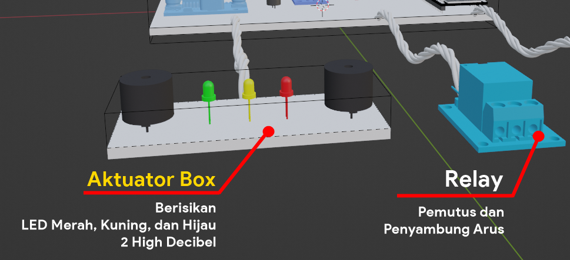
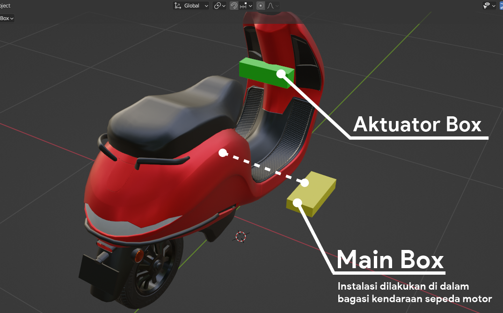

# Safety-Warning

## Final Project as a bachelor degree of Informatics Engineer

Various problems arise in the use of motorcycles. Among the common issues are the
high occurrence of traffic accidents at high speeds and motorcycle theft. Traffic
accidents generally happen due to users not adhering to safe speed limits, especially
in urban areas, while motorcycle theft is prevalent due to the minimal security
measures in place.    
Therefore, the aim of this research is to develop an integrated
hardware and software system capable of minimizing these issues using Fuzzy logic
methods followed by experimental field testing. The hardware system is constructed
using several electronic components such as sensors and actuators.    
The sensors used include GPS Ublox neo 6m, mpu6050, and sw420, while the actuators consist of a high
decibel buzzer, LED, and relay module. Other components such as the LM2596 step-
down DC module, SIM800L module, capacitors, and resistors are also utilized in the
circuitry process.    
For software development, Arduino IDE is used as the platform for
microcontroller script development, and MIT App Inventor is employed for designing
the mobile application interface.    
The system is broadly divided into two modes: driving
mode and parking mode. In driving mode, users are alerted about speed limits and the
maximum tilt angle while turning. In parking mode, the system secures the
motorcycle's electrical path using a relay and detects indications of theft using sensors.    
The results of this research include the design of a hardware and software system in
the form of a circuit that has been experimentally tested in the field. The implemented
design was then tested for accuracy of sensor readings and the compatibility of sensor
and actuator performance in following the specified logic commands.    
The accuracy testing of the sensors yielded values above 70%, and the actuators successfully
executed actions according to the embedded logic in the microcontroller. Therefore,
the developed and tested system can be deemed to work according to the
predetermined design.

## Components Needed
* ESP32 Development Board (1)  
* PCB (2)  
* Box (2)  
* LM2596 DC Stepdown Modul (2)  
* GPS Ublox Neo 6m (1)  
* SIM800L Module (1)  
* SW420 Vibration Sensor (1)  
* MPU6050 Gyroscope Sensor (1)  
* Relay Module 1 Channel (1)  
* 470uF 16V Capasitor (1)  
* 470uF 25V Capasitor (1)  
* High Decibel Buzzer (2)  
* LED (Red (1), Yellow(1), Green(1))  
* 220 ohm Resistor (3)  

## Wiring Diagram

### Wiring on board (PCB)  

### Wiring on Relay to Motorcycle Battery  

## Others  
### Main Box Design  

### Actuator Box Design  

### Implementation Design  

### MIT App Inventor  

